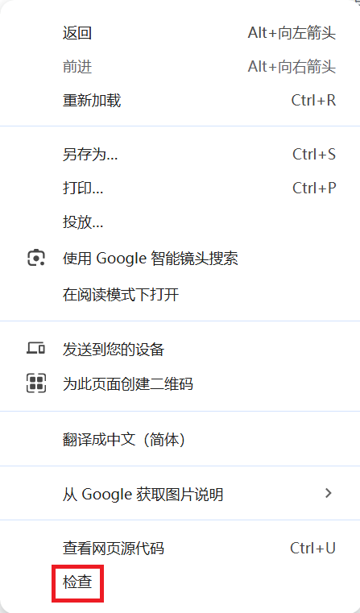
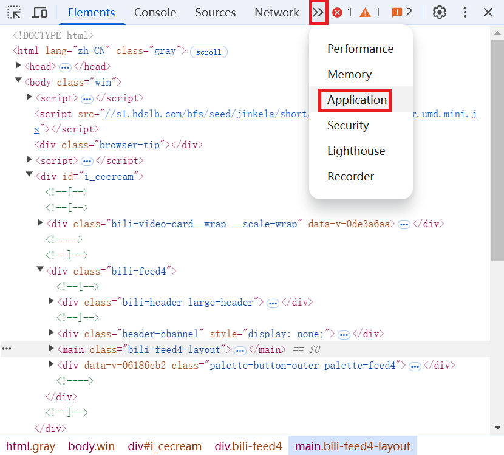
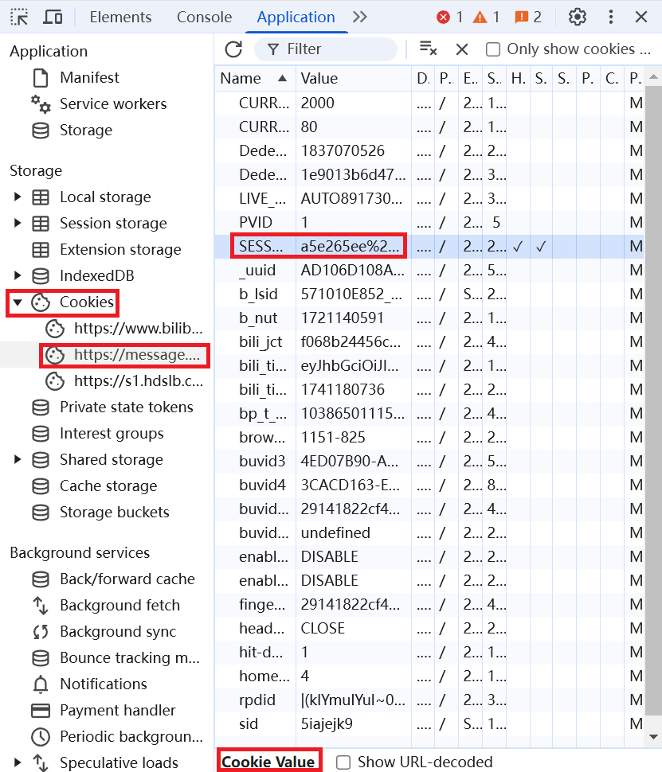

# Bilibili_Download
Download video or audio from bilibili

## 注意

* 软件不支持付费视频和地区限制视频，可能会报错
* 需要使用sessdata进行账号登录，如果没有sessdata会导致无法下载视频，sessdata仅用于获取视频的下载权限
* 未登录仅能下载最高480p视频，普通用户最大支持下载1080P视频，大会员最大支持下载8K视频
* b站视频是音画分离的，故可选择只下载视频或只下载音频，如两者同时选择下载，则会进行音视频合并

## 使用

* 在[releases](https://github.com/amenonioi/Bilibili_Download/releases)页面下载，python版本需自行安装requests库和questionary库
  ```bash
  $ python -m pip install requests
  ```
  ```bash
  $ python -m pip install questionary
  ```
* 若已有ffmpeg并已添加至环境变量，则无需下载带ffmpeg的版本

## 功能

* 下载视频
* 下载音频
* 下载封面
* 下载 合集/收藏夹/分p视频 中的视频（可选择全部下载或部分下载）
* 下载动漫
* PS：程序会记录上一次运行时 是否‘下载视频、音频、封面’的选择 作为下次运行时的默认选项；下载合集或收藏夹时会默认下载分p视频中的所有分p


## 可选择的默认设置

* 是否下载重名文件
* 是否将所有视频相关文件存储于文件夹中


## sessdata的获取

使用chrome浏览器打开b站，在登录状态下
右键 -> 检查 -> application -> cookies -> sessdata
复制下方cookie value中的内容






## 闲话
这是一个做着学习用的项目，功能跟其他下载器相差不大，如有不足请谅解
通常来说只要把网址完整的复制粘贴进程序就可以正常运行，如果没成功那可能是程序写的太菜了，没处理好
